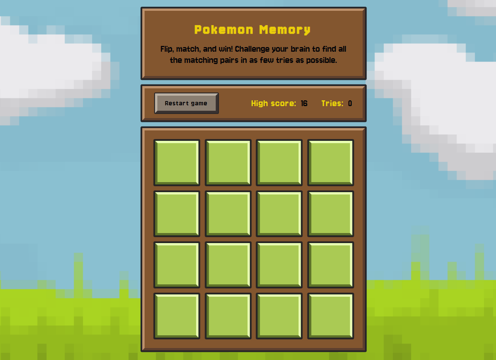
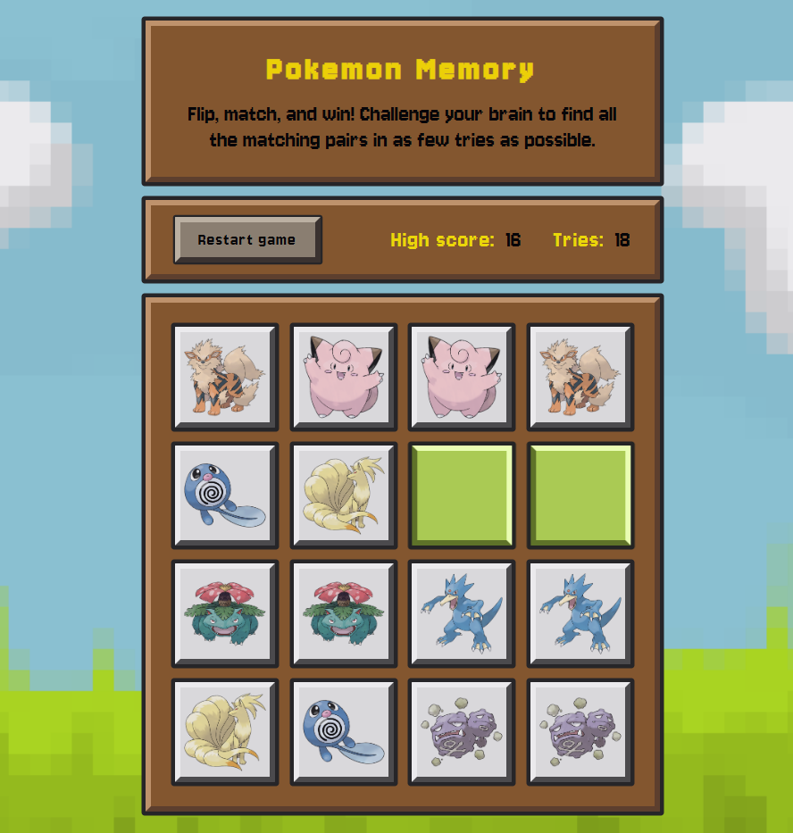
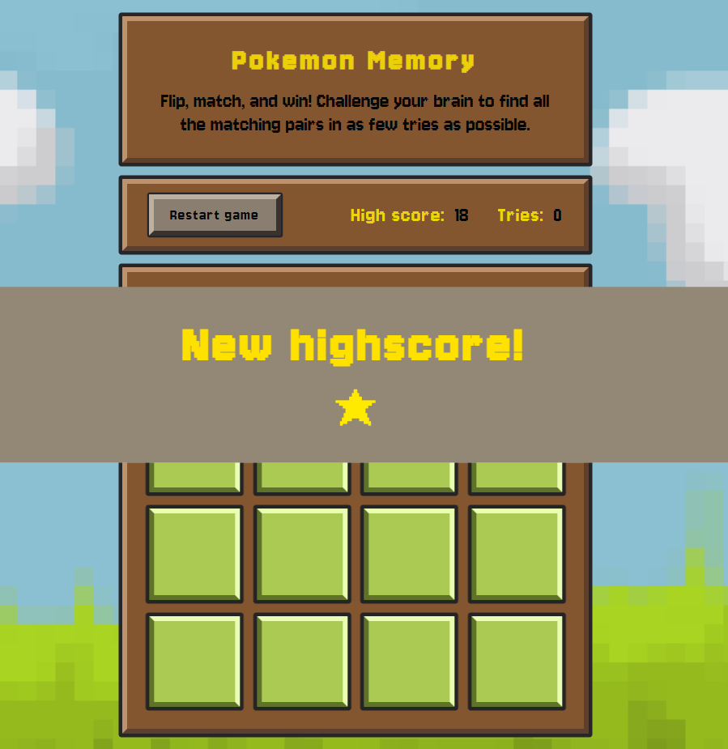

# Pokemon Memory

Flip, match, and win! Challenge your brain to find all the matching pairs in as few tries as possible in this Pokemon Memory game.

## Description

A simple memory game with images of pokemons fetched from the Pokemon API https://pokeapi.co/.

## Tech Stack

- React + Vite + TypeScript
- Axios for API-calls

## Features

- memory game with pokemon images
- flip animation
- high score saved to local storage
- confetti on game completion

## User Flow

1. Flip the cards
2. Get a match
3. Get confetti on completion

## Getting Started

### Prerequisites

Make sure the following are installed on your system:

- Node.js v18.16+ (includes npm)

### Installation

```bash
# 1. Clone the repo:
git clone https://github.com/maa-lin/Ember-Flow.git
cd ember-flow

# 2. Frontend setup
cd ../frontend
npm install
npm run dev


```

## Screenshots




